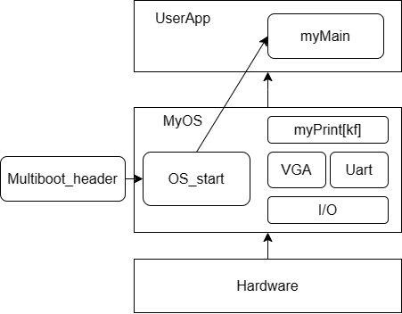
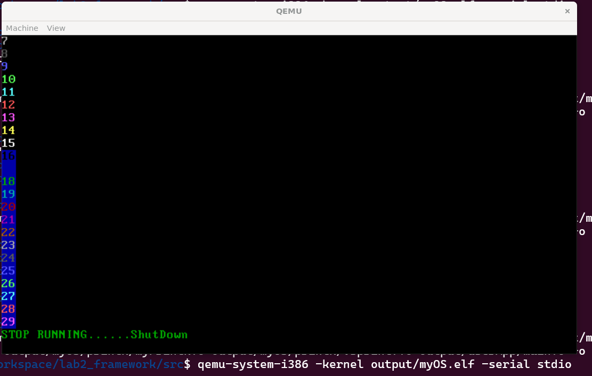

# 实验2 Multiboot2myMain

## 原理说明

* **软件结构框图及概述**

  本次实验实现的myOS中的软件遵循如下的架构：



    具体来说，首先由少量的内嵌汇编实现I/O的设计，然后基于端口和写显存实现VGA和Uart的输出模块，并进一步实现myPrint[kf]函数，最后完成用户模块userApp的实现，使得用户可以通过调用函数来输出格式化的字符串。

* **主流程的实现和相关流程图**

  本次实验基于实验一，由Multiboot_header到myOS的OS_start以及UserApp部分做了衔接，其中通过call语句来完成调用和跳转。具体的流程如下：

  1.由MultibootHeader.S的start位置开始引导系统，通过call _start跳转到start32.S。

  2.由start32.S构建堆栈，并初始化BSS段作为后续变量的存储块，末尾通过call osStart跳转至osStart.c。

  3.系统开始运行，并以内核态输出提示符。

  4.osStart.c调用myMain()函数，开始运行用户程序。

  5.用户程序运行结束，return到osStart.c，预结束系统运行。

  6.osStart.c进入实现写好的死循环当中，可视作系统已停机。

  

## 各功能模块及其实现

* **Multiboot_header**

  ```
  .globl start

  MAGIC = 0x1BADB002 # we use version 0.6.96 not version 2 (magic = 0xe85250d6)
  FLAGS = 0
  CHECKSUM = 0xE4524FFE   #(magic + checksum + flags should equal 0)

  .section ".multiboot_header"
  .align 4
    .long MAGIC
    .long FLAGS
    .long CHECKSUM

  .text
  .code32
  start:
    call _start
    hlt  
  ```

  以上是参考代码，相较于我在实验一中完成的代码，整体更为紧凑，且声明语句更为合理。本实验中我选用助教给出的参考代码实现。
* **I/O端口**

  ```c
  unsigned char inb(unsigned short int port_from){
      unsigned char value;
      __asm__ __volatile__("inb %w1,%b0":"=a"(value):"Nd"(port_from));
      return value;
  }

  void outb (unsigned short int port_to, unsigned char value){
      __asm__ __volatile__ ("outb %b0,%w1"::"a" (value),"Nd" (port_to));
  }
  ```

  通过c语言内嵌汇编实现。其中%w1为读端口，对应port_from和port，w对应一个字长（word），%b0表示要写入或读取的数据，对应参数value。"=a"(value)表示将inb读到的值存储到变量value中，"Nd"(port_from)表示将port_from作为立即数传递给inb指令，"Nd"(port_to)也类似。
* **VGA输出模块**

  ```c
  #define VGA_SCREEN_WIDTH 	80
  #define	VGA_SCREEN_HEIGHT	25
  #define	CURSOR_line		0xE
  #define CURSOR_col		0xF
  #define CURSOR_index		0x3D4
  #define CURSOR_data		0x3D5

  extern void outb (unsigned short int port_to, unsigned char value);
  extern unsigned char inb(unsigned short int port_from);
  //VGA字符界面规格：25行80列
  //VGA显存初始地址为0xB8000

  short cur_line=0;
  short cur_column=0;//当前光标位置
  char * vga_init_p=(char *)0xB8000;
  short offset=0;

  void update_cursor(void){
  	//计算偏移和行列
  	cur_line = offset / VGA_SCREEN_WIDTH;
  	cur_column = offset - cur_line * VGA_SCREEN_WIDTH;
  	outb(CURSOR_index, CURSOR_line);
  	outb(CURSOR_data, (offset >> 8)& 0xFF);
  	outb(CURSOR_index, CURSOR_col);
  	outb(CURSOR_data, offset & 0xFF);  
  }

  short get_cursor_position(void){
  	//获得当前光标的16位偏移值
  	outb(CURSOR_index, CURSOR_line);
  	offset = inb(CURSOR_data);
  	outb(CURSOR_index, CURSOR_col);
  	offset = offset<<8 + inb(CURSOR_data);
  	return offset;
  }


  void clear_screen(void) {
  	int *wp; //write pointer
  	int i = 0;
  	while (i < 0x1000)
  	{
  		wp = (int*)0xB8000 + i;
  		*wp = 0x0F200F20;
  		i += 4;
  	}
  	offset = 0;
  	update_cursor();
  }
  void scroll_screen(void){
  	int *rp,*wp;
  	int i = 0;
  	while (i < offset) 
  	{
  		wp =(int*)(0xB8000 + 2*i);
  		if(i < offset - VGA_SCREEN_WIDTH){
  			rp = (int*)(0xB8000 + 2*i + VGA_SCREEN_WIDTH*2);
  			*wp = *rp;
  		}
  		else 
  			*wp = 0x0F200F20;
  		i = i + 2;
  	}
  	offset -= VGA_SCREEN_WIDTH;
  	update_cursor();
  }
  void append_char(char str, int color){
  	update_cursor();
  	while (cur_line >= VGA_SCREEN_HEIGHT)
  	{
  		scroll_screen();
  	}
  	char *wp;
  	wp = vga_init_p + offset*2;
  	*wp = str;
  	wp += 1;
  	*wp = color;
  	offset += 1;
  	update_cursor();
  }
  void append2screen(char *str,int color){ 
  	for (int i = 0; str[i] != '\0'; i++)
  	{
  		switch (str[i])
  		{
  		case '\n':
  			offset = offset + VGA_SCREEN_WIDTH - offset % VGA_SCREEN_WIDTH;
  			update_cursor();
  			while (cur_line >= VGA_SCREEN_HEIGHT)
  			{
  				scroll_screen();
  			}
  			break;
  		case '\f':
  			clear_screen();
  			break;
  		case '\r':
  			offset = offset - offset % VGA_SCREEN_WIDTH;
  			update_cursor();
  			break;
  		case '\t':
  			offset += 4;
  			update_cursor();
  			while (cur_line >= VGA_SCREEN_HEIGHT)
  			{
  				scroll_screen();
  			}
  			break;
  		case '\v':
  			offset += VGA_SCREEN_WIDTH;
  			update_cursor();
  			while (cur_line >= VGA_SCREEN_HEIGHT)
  			{
  				scroll_screen();
  			}
  			break;
  		case '\b':
  			if(offset % VGA_SCREEN_WIDTH != 0){
  				offset -= 1;
  				update_cursor();
  			}
  			break;
  		default:
  			append_char(str[i],color);
  			break;
  		}
  	}

  }
  ```
* **Uart输出模块**

  ```c
  extern unsigned char inb(unsigned short int port_from);
  extern void outb (unsigned short int port_to, unsigned char value);

  #define uart_base 0x3F8

  void uart_put_char(unsigned char c){
  	//填写正确的内容
  	outb(uart_base, c);
  }

  unsigned char uart_get_char(void){
  	//填写正确的内容 
  	unsigned char ch;
  	while ((ch = inb(uart_base))== 0x00);
  	return ch;
  }

  void uart_put_chars(char *str){ 
  	//填写正确的内容
  	int index=0;
  	while (str[index]!='\0')
  	{
  		if(str[index]=='\n')
  		{
  			str[index] == '\r';
  		}
  		outb(uart_base,str[index]);
  		index++;
  	}
  }
  ```
* Print(即格式化输出)模块

  ```c
  #include <stdarg.h>

  extern void append2screen(char *str,int color);

  extern int vsprintf(char *buf, const char *fmt, va_list argptr);

  char kBuf[400];
  int myPrintk(int color,const char *format, ...){
  	int count;

  	va_list argptr;
  	va_start(argptr,format);//初始化argptr

  	count=vsprintf(kBuf,format,argptr);

  	append2screen(kBuf,color);//VGA输出

  	va_end(argptr);

  	return count;
  }

  char uBuf[400];
  int myPrintf(int color,const char *format, ...){
  	int count;

  	va_list argptr;
  	va_start(argptr,format);//初始化argptr

  	count=vsprintf(uBuf,format,argptr);

  	append2screen(uBuf,color);//VGA输出

  	va_end(argptr);

  	return count;
  }
  ```

  以上代码实现了print函数，以Printk函数为例，缓冲区为kBuf。实际上vsprint函数提供了将所给字符串格式化处理的功能，将处理后的字符串放在缓冲区中，并由kBuf分别在VGA和Uart串口上输出。

  用户态的printf函数仅做了缓冲区的改变。

## 源代码说明

文件夹的目录如下：

```
src
\multibootheader
	\multibootHeader.S
\myOS
	\dev
		\uart.c
		\vga.c
	\i386
		\io.c
		\io.h
	\printk
		\myPrintk.c
		\vsprintf.c
	\myOS.ld
	\osStart.c
	\start32.S
\output
\userApp
	\main.c		#用户程序
```

对应的makefile组织如下：

```
src
	\myOS
		\dev
		\i386
		\printk
	\userApp
```

## 代码布局（地址空间）说明

和实验一相同，代码布局仍然由连接描述文件的SECTIONS部分所决定。

```
OUTPUT_FORMAT("elf32-i386", "elf32-i386", "elf32-i386")
OUTPUT_ARCH(i386)
ENTRY(start)

SECTIONS {
	. = 1M;
	.text : {
	    *(.multiboot_header) 
		. = ALIGN(8);
		*(.text)
	}

	. = ALIGN(16);
	.data		: { *(.data*) }

	. = ALIGN(16);
	.bss		:
	{
		__bss_start = .;
		_bss_start = .;
		*(.bss)
		__bss_end = .;
	}
	. = ALIGN(16);
	_end = .;
	. = ALIGN(512);
}
```

上述代码指示了地址空间的布局，在offset=1M处为代码段，而后是按16字节对齐的数据段，bss段以及堆栈段。

## 编译过程说明

```makefile
SRC_RT = $(shell pwd)

CROSS_COMPILE =
ASM_FLAGS = -m32 --pipe -Wall -fasm -g -O1 -fno-stack-protector
C_FLAGS =  -m32 -fno-stack-protector -g

.PHONY: all
all: output/myOS.elf

MULTI_BOOT_HEADER=output/multibootheader/multibootHeader.o
include $(SRC_RT)/myOS/Makefile
include $(SRC_RT)/userApp/Makefile

OS_OBJS       = ${MYOS_OBJS} ${USER_APP_OBJS}

output/myOS.elf: ${OS_OBJS} ${MULTI_BOOT_HEADER}
	${CROSS_COMPILE}ld -n -T myOS/myOS.ld ${MULTI_BOOT_HEADER} ${OS_OBJS} -o output/myOS.elf

output/%.o : %.S
	@mkdir -p $(dir $@)
	@${CROSS_COMPILE}gcc ${ASM_FLAGS} -c -o $@ $<

output/%.o : %.c
	@mkdir -p $(dir $@)
	@${CROSS_COMPILE}gcc ${C_FLAGS} -c -o $@ $<

clean:
	rm -rf output

```

根目录下的makefile文件指示了编译过程：

1.include各目录下的makefile文件，然后将使用汇编语言和C语言书写的源文件编译为.o文件

2.使用链接器生成myOS.elf文件

文件中包含的clean部分会清除output文件夹下的所有内容，以便于调试。

## 运行和运行结果说明

按照实验文档的运行方法，编译运行脚本文件后得到的结果如下：



即VGA显存显示了正确的结果，表面编译过程和代码原理无误。

## 遇到的问题和解决方案

实验中，在编写vga.c文件时，对于get_cursor_position()返回的16bit偏移值到cur_line和cur_column的转化是一个逻辑并不那么显然的点。最终得到的结果是通过移位运算分别得到行和列的偏移值，并利用代数关系更新cur_line和cur_column的值。
