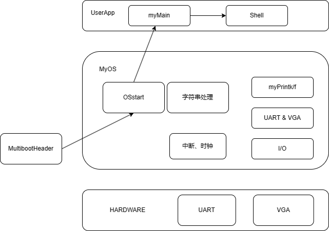
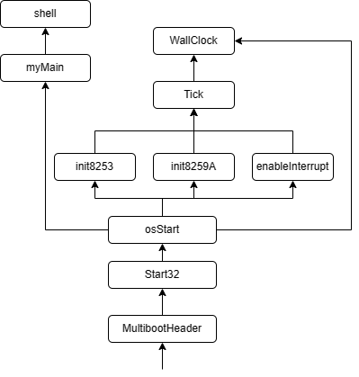
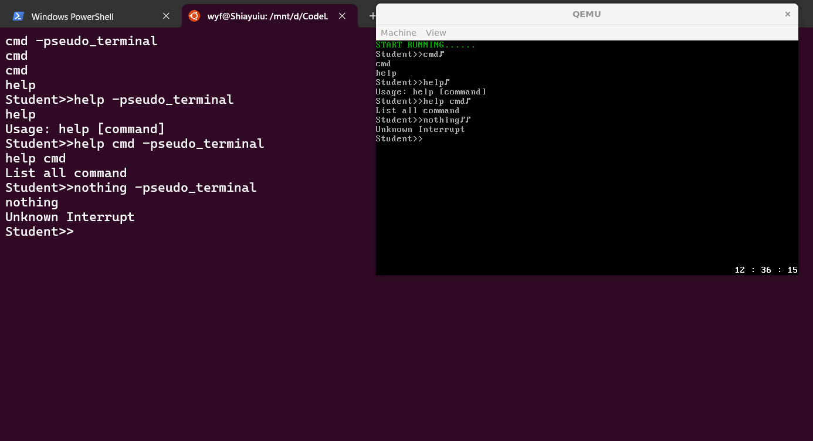

# 实验3 Start2shell

## 原理说明

* 软件结构框图
  
  以上是本次实验的软件结构框图，其中底层端口I/O由内嵌汇编完成，VGA和串口的输出及中断控制器的初始化都基于端口I/O实现；时钟中断的处理基于中断控制器展开，WallClock的实现基于Tick和VGA输出实现；用户程序调用函数实现Shell功能。
* 主流程及流程图

  

  上述是本次实验的流程图：包括以下的流程：由MultibootHeader引导系统->跳转至start32.s，初始化必要字段->跳转至osStart.c，运行myOS，初始化各中断控制器，实现tick并初始化wallClock->用户程序myMain()->启动shell。

## 主要功能模块实现及流程图

* 中断机制实现

  * 中断处理

    ```
    #start32.S文件TODO部分
    time_interrupt:
    	cld
    	pushf
    	pusha
    	call tick
    	popa
    	popf
    	iret		#上述process调用tick实现中断
    	.p2align 4
    ignore_int1:
    	cld
    	pusha
    	call ignoreIntBody
    	popa
    	iret		#上述process实现其余中断
    ```

    ```
    #irq.S文件内容
    .text
    .code32
    _start:
    	.globl enable_interrupt
    enable_interrupt:
    	sti
    	ret
    	.globl disable_interrupt
    disable_interrupt:
    	cli
    	ret
    ```

  ```c
  //i8253.c文件内容
  #include "io.h"
  #define CONST_FREQ 1193182
  #define CONST_FREQ_INTERRUPT 100
  unsigned short CONST_FREQ_DIV = CONST_FREQ / CONST_FREQ_INTERRUPT;//时钟分频
  void init8253(void){
  	//init
  	outb(0x43, 0x34);
  	outb(0x40, (unsigned char)CONST_FREQ_DIV);
  	outb(0x40, (unsigned char)(CONST_FREQ_DIV >> 8));//将高八位和低八位分别送入

  	outb(0x21, inb(0x21) & 0xFE);//启用时钟中断
  }
  ```

  ```c
  //i8259A.c文件内容
  #include "io.h"
  void init8259A(void){
  	//masked
  	outb(0x21, 0xFF);
  	outb(0xA1, 0xFF);
  	//init master chip
  	outb(0x20, 0x11);
  	outb(0x21, 0x20);
  	outb(0x21, 0x04);
  	outb(0x21, 0x3);
  	//init slave chip
  	outb(0xA0, 0x11);
  	outb(0xA1, 0x28);
  	outb(0xA1, 0x02);
  	outb(0xA1, 0x1);
  }
  ```
* Tick实现

  ```c
  #include "wallClock.h"
  int system_ticks=0;
  int HH=12,MM=34,SS=56;

  void tick(void){
  	system_ticks++;
  	//update wallclock
  	if(system_ticks == 100){
  		system_ticks = 0;
  		SS = ((SS+1)==60)?0:SS+1;
  		if(!SS) MM = ((MM+1)==60)?0:MM+1;
  		if(!SS & !MM) HH = ((HH+1)==24)?0:HH+1;
  	}
  	setWallClock(HH, MM, SS);
  	return;
  }
  ```

  上述代码实现了tick()函数，其中WallClock的初值被定义为12:34:56，当system_ticks的值达到SS变化对应的值时（即1s）跳回0，然后根据当前的时分秒值更新下一秒的值，并显示墙钟。
* WallClock实现

  ```c
  #include "vga.h"
  #include "tick.h"
  void setWallClock(int HH,int MM,int SS){
  	char DISPLAYED_CLOCK[12];

  	DISPLAYED_CLOCK[0] = '0' + HH/10;
  	DISPLAYED_CLOCK[1] = '0' + HH%10;
  	DISPLAYED_CLOCK[2] = ' ';
  	DISPLAYED_CLOCK[3] = ':';
  	DISPLAYED_CLOCK[4] = ' ';
  	DISPLAYED_CLOCK[5] = '0' + MM/10;
  	DISPLAYED_CLOCK[6] = '0' + MM%10;
  	DISPLAYED_CLOCK[7] = ' ';
  	DISPLAYED_CLOCK[8] = ':';
  	DISPLAYED_CLOCK[9] = ' ';
  	DISPLAYED_CLOCK[10]= '0' + SS/10;
  	DISPLAYED_CLOCK[11]= '0' + SS%10;

  	put_chars(DISPLAYED_CLOCK, 0xf, VGA_COL - 1 , VGA_ROW -12);
  }

  void getWallClock(int *HH,int *MM,int *SS){
  	*HH = HH;
  	*MM = MM;
  	*SS = SS;
  }
  ```

  上述代码实现了墙钟的显示和读取，使用字符数组和封装过的put_chars函数将墙钟显示到指定位置。
* Shell实现

  ```c
  #include "io.h"
  #include "myPrintk.h"
  #include "uart.h"
  #include "vga.h"
  #include "i8253.h"
  #include "i8259A.h"
  #include "tick.h"
  #include "wallClock.h"

  int *h,*m,*s;
  typedef struct myCommand {
      char name[80];
      char help_content[200];
      int (*func)(int argc, char (*argv)[8]);
  }myCommand; 
  int func_cmd(int argc, char(*argv)[8]);
  int func_help(int argc, char(*argv)[8]);
  myCommand cmd={"cmd\0","List all command\n\0",func_cmd};
  myCommand help={"help\0","Usage: help [command]\n\0Display info about [command]\n\0",func_help};

  int bufdiv(char* str,int len, char (*argv)[8]){
      int count = 0;
      int i = 0;
      char* p = str;
      while (*p)
      {  
          if((*p)==' '){
              while(*p++ == ' ');
              if(*--p){
                  argv[count][i] = '\0';
                  i = 0;
                  count++;
              }
          }
          else{
              argv[count][i++] = *p++;
          }
        
      }
      argv[count++][i] = '\0';
      return count;
  }

  int func_cmd(int argc, char (*argv)[8]){
  	if(argc == 1){
          myPrintk(0x7, "cmd\nhelp\n\0");
      }
      else {
          myPrintk(0x7, "Unknown Interrupt.\n\0");
      }
      return 0;
  }

  int func_help(int argc, char (*argv)[8]){
      if(argc == 1){
          myPrintk(0x7, help.help_content);
          return 0;
      }
      else if(argc == 2){
          if(!myStrcmp(argv[1],"cmd\0")){
              myPrintk(0x7,cmd.help_content);
              return 0;
          }
      }
      else {
          myPrintk(0x7,"Unknown Interrupt.\n\0");
          myPrintk(0x7, argc);
      }
      return 0;
  }


  void startShell(void){
  //我们通过串口来实现数据的输入
  char BUF[256]; //输入缓存区
  int BUF_len=0;	//输入缓存区的长度
    
  	int argc;
      char argv[8][8];

      do{
          int s0 = *s;
          getWallClock(h,m,s);
          if(*s != s0){
              setWallClock(*h, *m, *s);
          }

          BUF_len=0; 
          myPrintk(0x07,"Student>>\0");
          while((BUF[BUF_len]=uart_get_char())!='\r'){
              uart_put_char(BUF[BUF_len]);//将串口输入的数存入BUF数组中
              BUF_len++;  //BUF数组的长度加一
          }
          uart_put_chars(" -pseudo_terminal\0");
          uart_put_char('\n');
          myPrintk(0x7, BUF);
          myPrintk(0x7, "\n");
          argc = bufdiv(BUF,BUF_len,argv);
          if(!myStrcmp("cmd\0",argv[0])){
              func_cmd(argc,argv);
          }
          else if(!myStrcmp("help\0",argv[0])){
              func_help(argc,argv);
          }
          else{
              myPrintk(0x7,"Unknown Interrupt\n\0");
          }

      }while(1);

  }
  int myStrcmp(const char* str1, const char* str2){
      while (*str1)
      {
          while(*str1++ == *str2++);
      }
      return (int)(*str1 - *str2);
  }
  ```

上述代码实现了Shell，其中的bufdiv函数实现了将缓冲区的字符划分成各个字段放入argv字符串数组中，并返回argc作为参数，然后根据得到的值进行对应的操作。

## 源代码说明

* 目录组织

  ```
  src
  ├── multibootheader
  │   └── multibootHeader.S 
  ├── myOS
  │   ├── dev
  │   │   ├── i8253.c 
  │   │   ├── i8259A.c 
  │   │   ├── uart.c 
  │   │   └── vga.c  
  │   ├── i386
  │   │   ├── io.c 
  │   │   ├── irq.S 
  │   │   ├── irqs.c 
  │   ├── include
  │   │   ├── io.h
  │   │   ├── myPrintk.h 
  │   │   ├── i8253.h
  │   │   ├── i8259A.h
  │   │   ├── irqs.h
  │   │   ├── tick.h
  │   │   ├── uart.h
  │   │   ├── vga.h
  │   │   ├── vsprintf.h
  │   │   └── wallClock.h
  │   ├── kernel
  │   │   ├── tick.c 
  │   │   └── wallClock.c 
  │   ├── osStart.c 
  │   ├── printk
  │   │   ├── vsprintf.c
  │   │   └── myPrintk.c 
  │   └── start32.S 
  └── userApp
      ├── main.c 
      └── startShell.c 
  ```
* makefile组织

  ```
  src
  ├── myOS
  │   ├── dev
  │   ├── i386
  │   ├── kernel
  │   ├── printk
  └── userApp
  ```

## 代码布局说明

本次实验的地址空间如下：

| Offset    | field | Note         |
| --------- | ----- | ------------ |
| 1M        | .text | 代码段       |
| ALIGN(16) | .data | 数据段       |
| ALIGN(16) | .bss  | bss段        |
| ALIGN(16) |       | 堆栈起始地址 |

## 编译过程说明

编译过程大致同实验二，第一步为编译各.S源文件与.c源文件到.o文件，第二步为将.o文件进行链接，生成.elf可执行文件。

## 运行结果及说明

在WSL的Ubuntu环境下运行脚本并在重定向的终端中输入测试指令，得到如下的运行结果，经验证是正确的：


