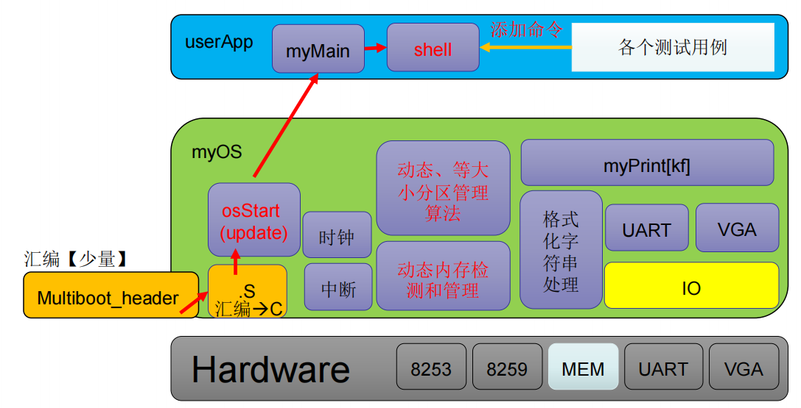
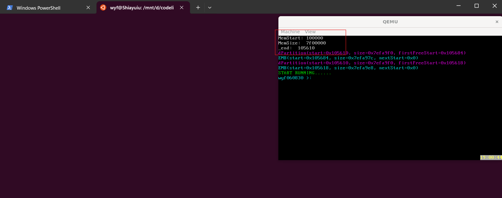
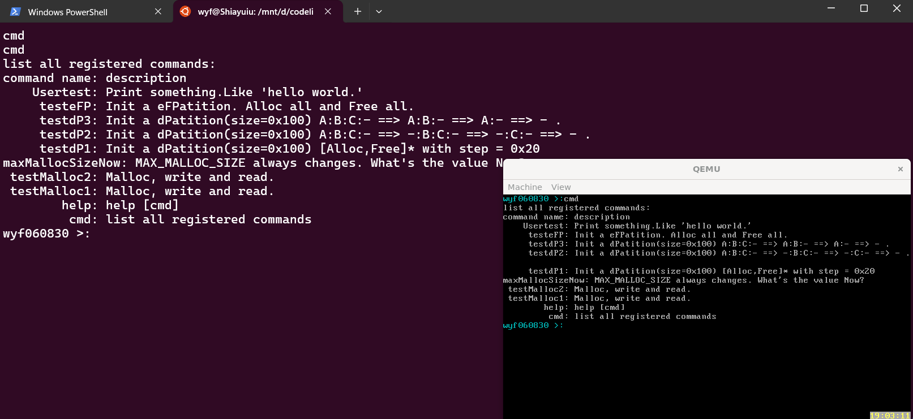
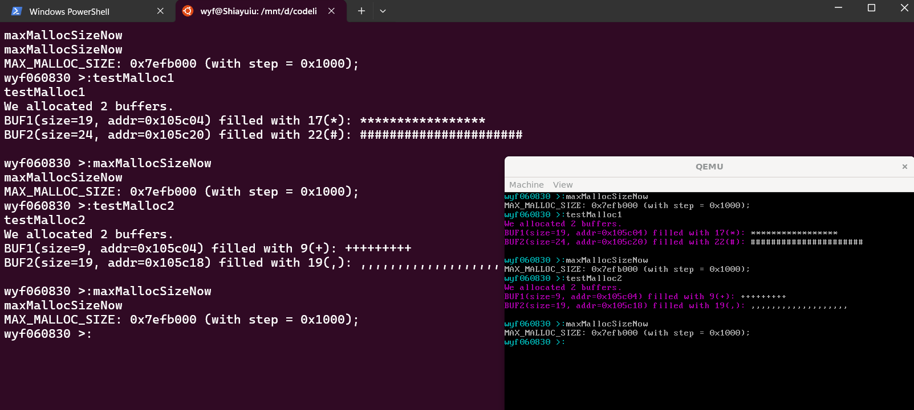
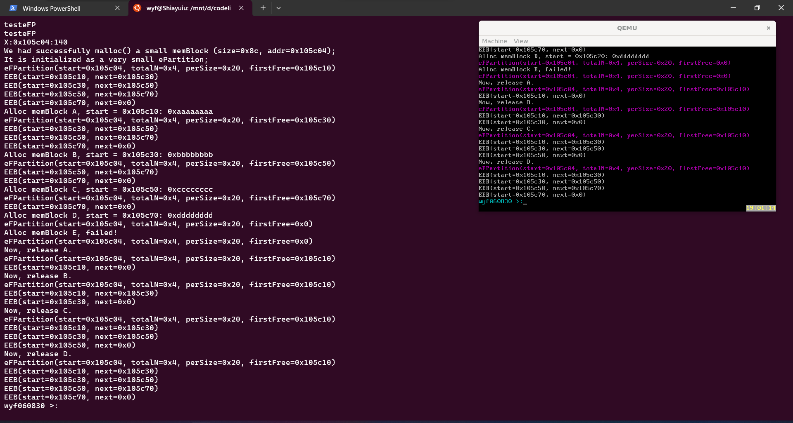
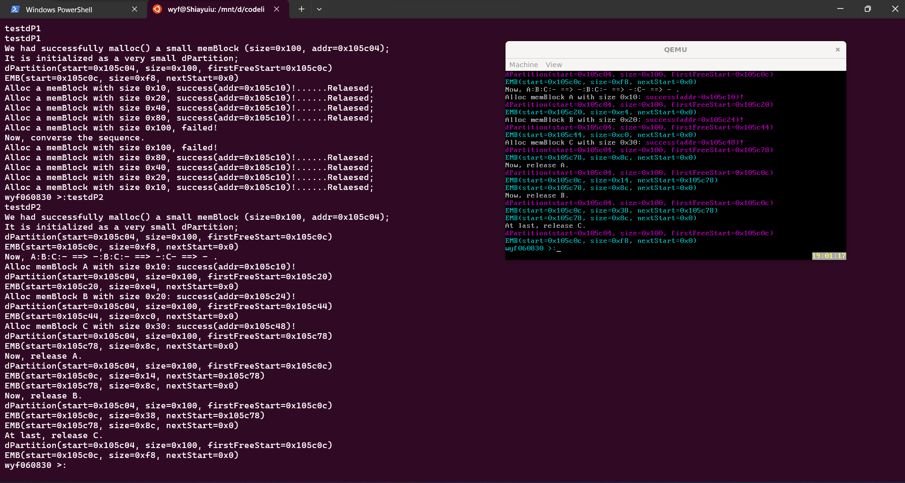
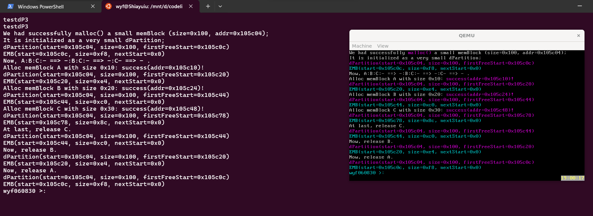
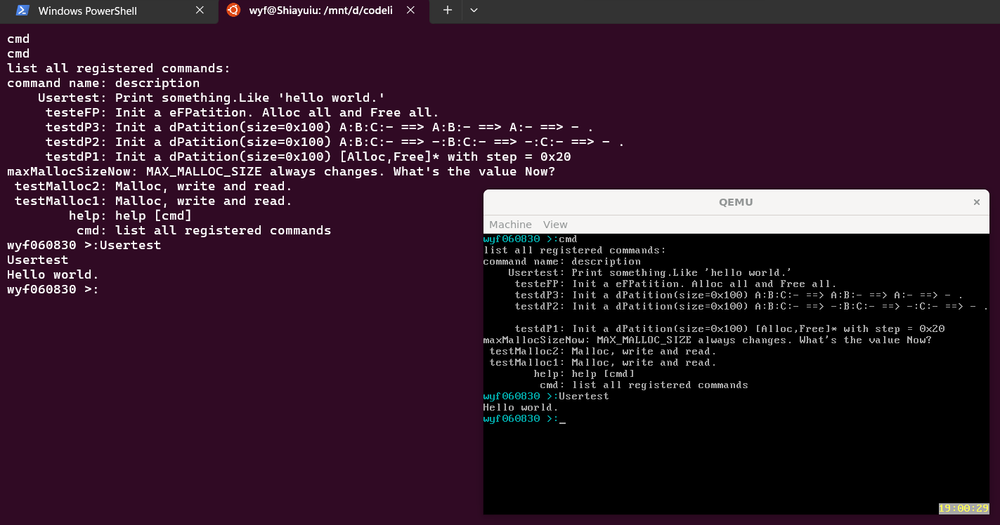

# 实验4 Memory Management

## 原理说明

* 软件结构框图及主流程的流程图
  
  这里的图片来自于老师给出的PPT中，可以看到，本次实验流程为：由MultibootHeader引导系统->跳转至osStart，开始运行系统myOS，这一步同时也初始化了i8259和i8253，实现时钟中断Tick；此外，memTest和pMemInit也在osStart中一并完成->运行用户程序myMain，初始化shell添加相关命令的同时初始化内存管理算法的测试样例，然后启动shell.

## 主要功能模块实现

我的实验4基于助教给出的框架代码完成，并在特定位置作了修改，例如：将部分typedef的重定义名称做了修改、加入了部分个性化的命令行提示。

下面给出各功能模块的实现（即实验讲义中的TODO部分）：

**1.内存检测算法 memTest**

在内存检测算法中，主要逻辑是向内存中写入数据并读取，然后通过数据是否一致判断内存是否可用；同时，考虑到内存中可能预先存放有数据，需要添加变量来缓存内存中可能存放的数据，在这里的代码中为变量 `data_buf` 。具体的实现逻辑中，使用了一个while循环，当发现内存不可用时直接跳出循环，并给出当前有效的内存大小。

```c
void memTest(unsigned long start, unsigned long grainSize){
	//initialize
	if(start < 0x100000){
		start = 0x100000;	//最小起始地址
	}
	if(grainSize < 2){
		grainSize = 2;		//最小步长
	}
	pMemStart = start;
	pMemSize  = 0;
	unsigned long  test_addr = start;	//标识当前检测的内存地址
	unsigned short *test_h, *test_t;	//标识检测区域的头尾各两个字节
	unsigned short data_buf;		//缓存内存中预先可能存放的数据
	unsigned short const1 = 0xAA55;
	unsigned short const2 = 0x55AA;
	while (1)
	{

		test_h = (unsigned short*)test_addr;
		test_t = (unsigned short*)(test_addr +  grainSize - 2);

		data_buf = *test_h;
		*test_h = const1;
		if(*test_h != const1){
			break;
		}
		*test_h = const2;
		if(*test_h != const2){
			break;
		}
		*test_h = data_buf; 

		data_buf = *test_t;
		*test_t = const1;
		if(*test_t != const1){
			break;
		}
		*test_t = const2;
		if(*test_t != const2){
			break;
		}
		*test_t = data_buf;

		test_addr = test_addr + grainSize;
		pMemSize = pMemSize + grainSize;
	}


	//需要返回可用内存块的起始地址和大小
	myPrintk(0x7,"MemStart: %x  \n", pMemStart);
	myPrintk(0x7,"MemSize:  %x  \n", pMemSize );

}
```

**2.内存分区管理相关算法**

dPartion.c文件与eFPartion.c文件中实现的函数逻辑上类似，这里先给出eFPartion.c中各函数的实现。

* 查看和调试eFPartion结构体信息

  ```c
  void eFPartitionWalkByAddr(unsigned long efpHandler){
  	eFPartition *handler = (eFPartition*)efpHandler;
  	showeFPartition(handler);
  	//遍历EEB
  	unsigned long p = handler->firstFree;
  	EEB* block_h;
  	while (p)
  	{
  		block_h = (EEB*)p;
  		showEEB(block_h);
  		p = block_h->next_start;
  	}

  }
  ```
* 计算占用空间大小

  ```c
  unsigned long align_by_4(unsigned long v){
  	if(v & 1) v += 1;
  	if(v & 2) v += 2;
  	return v;
  }

  unsigned long eFPartitionTotalSize(unsigned long perSize, unsigned long n){
  	/*功能：计算占用空间的实际大小，并将这个结果返回*/
  	//合法性检查
  	if(perSize <= 0){
  		return 0;
  	}

  	unsigned long perSize_aligned = align_by_4(perSize);	//对齐perSize
  	return perSize_aligned*n + eFPartition_size + EEB_size;	//考虑到EEB本身和数据结构本身占用空间
  }
  ```
* 初始化内存

  ```c
  unsigned long eFPartitionInit(unsigned long start, unsigned long perSize, unsigned long n){
  	/*功能：初始化内存
  	1. 需要创建一个eFPartition结构体，需要注意的是结构体的perSize不是直接传入的参数perSize，需要对齐。结构体的next_start也需要考虑一下其本身的大小。
  	2. 就是先把首地址start开始的一部分空间作为存储eFPartition类型的空间
  	3. 然后再对除去eFPartition存储空间后的剩余空间开辟若干连续的空闲内存块，将他们连起来构成一个链。注意最后一块的EEB的nextstart应该是0
  	4. 需要返回一个句柄，也即返回eFPartition *类型的数据
  	*/

  	//合法性检查
  	if(perSize <= 0) {
  		return 0;
  	}

  	unsigned long perSize_aligned = align_by_4(perSize);
  	eFPartition* handler = (eFPartition*)start;
  	unsigned long addr = start + eFPartition_size;

  	handler->perSize = perSize_aligned;
  	handler->totalN = n;
  	handler->firstFree = addr;

  	EEB* block;
  	//依次开出连续空闲内存块并组织成链
  	for(int i=0;i<n;i++) {
  		block = (EEB*)addr;
  		addr += perSize_aligned;
  		block->next_start = addr;
  	}
  	block->next_start = 0;

  	return start;
  }
  ```
* 分配及释放空间

  ```c
  unsigned long eFPartitionAlloc(unsigned long EFPHandler){
  	/*功能：分配一个空间
  	1. 本函数分配一个空闲块的内存并返回相应的地址，EFPHandler表示整个内存的首地址
  	2. 事实上EFPHandler就是我们的句柄，EFPHandler作为eFPartition *类型的数据，其存放了我们需要的firstFree数据信息
  	3. 从空闲内存块组成的链表中拿出一块供我们来分配空间，并维护相应的空闲链表以及句柄
  	*/
  	eFPartition* handler = (eFPartition*)EFPHandler;

  	//无法分配的情况
  	if(!handler->firstFree) {
  		return 0;
  	}
  	EEB* block = (EEB*)handler->firstFree;
  	handler->firstFree = block->next_start;

  	return (unsigned long)block;
  }
  unsigned long eFPartitionFree(unsigned long EFPHandler,unsigned long mbStart){
  	/*功能：释放一个空间
  	1. mbstart将成为第一个空闲块，EFPHandler的firstFree属性也需要相应大的更新。
  	2. 同时我们也需要更新维护空闲内存块组成的链表。
  	*/
  	eFPartition* handler = (eFPartition*)EFPHandler;
  	//合法性检查
  	if(mbStart < EFPHandler + eFPartition_size){
  		return 0;
  	}
  	if(mbStart > EFPHandler + eFPartitionTotalSize(handler->perSize, handler->totalN)) {
  		return 0;
  	}

  	unsigned long addr = handler->firstFree;
  	unsigned long addr_pre = 0;
  	unsigned long addr_nxt = 0;
  	EEB* block;
  	//下面的循环实际上扩展了回收范围，即addr_pre最后一定给出了在mbStart之前的连续空闲块的首地址
  	while(addr){
  		block = (EEB*)addr;
  		if(addr < mbStart){
  			addr_pre = addr;
  		}
  		else if(addr > mbStart){
  			addr_nxt = addr;
  			break;
  		}
  		addr = block->next_start;
  	}

  	//这里需要考虑在mbStart前后是否有空闲块，然后对相应的指针操作，包括合并和指针的修改
  	block = (EEB*)mbStart;
  	if(addr_nxt) {
  		block->next_start = addr_nxt;
  	}
  	else {
  		block->next_start = 0;
  	}
  	if(addr_pre) {
  		EEB* block_pre = (EEB*)addr_pre;
  		block_pre->next_start = mbStart;
  	}
  	else {
  		handler->firstFree = mbStart;
  	}

  	return SUC; //回收成功的返回值
  }

  ```

下面给出dPartion.c中各函数的实现:

* dPartionInit()和dPartionWalkByAddr()函数的实现和eFPartion.c中的逻辑是类似的，不再赘述

  ```c
  unsigned long dPartitionInit(unsigned long start, unsigned long totalSize){
  	// TODO
  	/*功能：初始化内存。
  	1. 在地址start处，首先是要有dPartition结构体表示整个数据结构(也即句柄)。
  	2. 然后，一整块的EMB被分配（以后使用内存会逐渐拆分），在内存中紧紧跟在dP后面，然后dP的firstFreeStart指向EMB。
  	3. 返回start首地址(也即句柄)。
  	*/
  	if(EMB_size + dPartition_size >= totalSize){
  		return 0;
  	}

  	dPartition *h = (dPartition*)start;
  	h->size = totalSize;
  	h->firstFreeStart = start + dPartition_size;

  	EMB	*block_h = (EMB*)h->firstFreeStart;
  	block_h->size = totalSize - dPartition_size;
  	block_h->nextStart = 0;

  	return start;
  }
  void dPartitionWalkByAddr(unsigned long dp){
  	/*功能：本函数遍历输出EMB 方便调试
  	1. 先打印dP的信息，可调用上面的showdPartition。
  	2. 然后按地址的大小遍历EMB，对于每一个EMB，可以调用上面的showEMB输出其信息
  	*/
  	dPartition *dp_h = (dPartition*)dp;
  	showdPartition(dp_h);

  	//遍历EMB
  	unsigned long p = dp_h->firstFreeStart;
  	EMB* block_h;
  	while (p)
  	{
  		block_h = (EMB*)p;
  		showEMB(block_h);
  		p = block_h->nextStart;
  	}
  }
  ```
* Alloc和Free

  ```c
  unsigned long dPartitionAllocFirstFit(unsigned long dp, unsigned long size){
  	/*功能：分配一个空间
  	1. 使用firstfit的算法分配空间，
  	2. 成功分配返回首地址，不成功返回0
  	3. 从空闲内存块组成的链表中拿出一块供我们来分配空间(如果提供给分配空间的内存块空间大于size，我们还将把剩余部分放回链表中)，并维护相应的空闲链表以及句柄
  	*/
  	//合法性检查
  	if(size <= 0) {return 0;}
  	//按字节对齐
  	if(size & 1) size += 1;
  	if(size & 2) size += 2;
  	if(size & 4) size += 4;

  	dPartition *dp_h = (dPartition*)dp;
  	if(!(dp_h->firstFreeStart)) {return 0;} //无法分配的情况

  	unsigned long addr = dp_h->firstFreeStart;
  	unsigned long addr_pre = 0;
  	EMB *block;
  	EMB *block_pre;
  	//按FirstFit算法分配空间
  	while (addr)
  	{
  		block = (EMB*)addr;
  		block_pre = (EMB*)addr_pre;
  		//注意if的判断条件，需要考虑EMB的自身占用大小，其中EMB的size域占用为sizeof(unsigned long)
  		if(block->size >= size + sizeof(unsigned long) && block->size <= size + sizeof(unsigned long) + EMB_size) {
  			if(addr_pre == 0){
  				dp_h->firstFreeStart = block->nextStart;
  			}
  			else {
  				block_pre->nextStart = block->nextStart;
  			}
  			return addr + sizeof(unsigned long);
  		}
  		//这里的if判断条件同理
  		else if(block->size > size + sizeof(unsigned long)+ EMB_size) {
  			unsigned long newnode = addr + sizeof(unsigned long) + size;
  			EMB* newblock = (EMB*)newnode;
  			newblock->size = block->size - size - sizeof(unsigned long);
  			newblock->nextStart = block->nextStart;
  			block->size -= newblock->size;

  			if(!addr_pre){
  				dp_h->firstFreeStart = newnode;
  			}
  			else {
  				block_pre->nextStart = newnode;
  			}
  			return addr + sizeof(unsigned long);
  		}
  		addr_pre = addr;
  		addr = block->nextStart;
  	}

  	return 0; //when failed
  }

  unsigned long dPartitionFreeFirstFit(unsigned long dp, unsigned long start){
  	/*功能：释放一个空间
  	1. 按照对应的fit的算法释放空间
  	2. 注意检查要释放的start~end这个范围是否在dp有效分配范围内
  		返回1 没问题
  		返回0 error
  	3. 需要考虑两个空闲且相邻的内存块的合并
  	*/
  	start = start - sizeof(unsigned long);	//这里需要减掉分配时加上的额外部分,即EMB的size域占用

  	if(start < dp + dPartition_size){
  		return 0;
  	}
  	dPartition *dp_h = (dPartition*)dp;
  	if(start >= dp_h->size + dp){
  		return 0;
  	}

  	unsigned long addr = dp_h->firstFreeStart;
  	unsigned long addr_pre;
  	unsigned long addr_nxt;
  	EMB* block;

  	while (addr)
  	{
  		block = (EMB*)addr;
  		if(addr < start){
  			addr_pre = addr;
  		}
  		else if(addr > start){
  			addr_nxt = addr;
  			break;
  		}
  		addr = block -> nextStart;
  	}

  	block = (EMB*)start;
  	if(addr_nxt) {
  		if(addr_nxt == start + block->size) {
  			EMB* block_nxt = (EMB*)addr_nxt;
  			block->size += block_nxt->size;
  			block->nextStart = block_nxt->nextStart;
  		}
  		else {
  			block->nextStart = addr_nxt;
  		}
  	}
  	else {
  		block->nextStart = 0;
  	}

  	if(addr_pre) {
  		EMB* block_pre = (EMB*)addr_pre;
  		if(start == addr_pre + block_pre->size) {
  			block_pre->size += block->size;
  			block_pre->nextStart = block->nextStart;
  		}
  		else {
  			block_pre->nextStart = start;
  		}
  	}
  	else {
  		dp_h->firstFreeStart = start;//已无空闲块
  	}
  	return 1;
  }
  ```

**3.shell动态注册命令 addNewCmd**

在这个函数中，只需要创建新的command结构体指针，并将传入的参数赋值到对应变量即可，注意需要考虑分配失败的情况。为了维护ourCmds链表，可以采用头插法，将每次新增的结点插到已有链表的头部，并将头指针指向该节点。

```c
void addNewCmd(
	unsigned char *cmd, 
	int (*func)(int argc, unsigned char **argv), 
	void (*help_func)(void), 
	unsigned char* description
){

    Command *newCommand = (Command*)malloc(sizeof(Command));
    //分配失败的情况
    if(!newCommand)
        return;

    strncpy(cmd, newCommand->cmd, 20+1);
    strncpy(description, newCommand->description, 100+1);
    newCommand->func = func;
    newCommand->help_func = help_func;

    //头插法维护链表
    newCommand->nextCmd = ourCmds;
    ourCmds = newCommand;
}
```

## 源代码说明

目录组织如下：

```
src
├─ multibootheader
│  └─ multibootHeader.S
├─ myOS
│  ├─ dev
│  │  ├─ i8253.c
│  │  ├─ i8259A.c
│  │  ├─ uart.c
│  │  └─ vga.c
│  ├─ i386
│  │  ├─ io.c
│  │  ├─ irq.S
│  │  └─ irqs.c
│  ├─ include
│  │  ├─ i8253.h
│  │  ├─ i8259.h
│  │  ├─ io.h
│  │  ├─ irq.h
│  │  ├─ kmalloc.h
│  │  ├─ malloc.h
│  │  ├─ mem.h
│  │  ├─ myPrintk.h
│  │  ├─ string.h
│  │  ├─ uart.h
│  │  ├─ vga.h
│  │  ├─ vsprintf.h
│  │  └─ wallClock.h
│  ├─ kernel
│  │  ├─ mem
│  │  │  ├─ dPartition.c
│  │  │  ├─ eFPartition.c
│  │  │  ├─ Makefile
│  │  │  ├─ malloc.c
│  │  │  └─ pMemInit.c
│  │  ├─ tick.c
│  │  └─ wallClock.c
│  ├─ lib
│  │  └─ string.c
│  ├─ osStart.c
│  ├─ printk
│  │  ├─ myPrintk.c
│  │  ├─ types.h
│  │  └─ vsprintf.c
│  ├─ start32.S
│  └─ userInterface.h
└─ userApp
   ├─ main.c
   ├─ memTestCase.c
   ├─ memTestCase.h
   ├─ shell.c
   └─ shell.h
```


Makefile组织如下：

```
src
├── myOS
│   ├── dev
│   ├── i386
│   ├── kernel
│   │   └── mem
│   ├── lib
│   └── printk
└── userApp
```

## 地址空间说明

| Offset    | Field | Note                  |
| --------- | ----- | --------------------- |
| 1M        | .text | 代码段                |
| Align(16) | .data | 数据段                |
| Align(16) | .bss  | bss段                 |
| Align(16) |       | _end 空闲内存起始地址 |

## 运行结果及说明

在wsl的Ubuntu环境下运行，得到的结果如下：

* **内存检测**
  
  上面的红框里给出了内存检测的结果，显示内存是正常的。事实上，我只有在框架的Mymain( )函数中注释掉了clearscreen( )函数这一行才能看到它，即程序完成内核初始化进入用户程序时清了一次屏导致看不到结果，下面是我发现这个情况的思路。

  ```c
  //osStart.c文件中调用了myMain()
  void osStart(void){
  	init8259A();
  	init8253();
  	enable_interrupt();
  	clear_screen();
  	pMemInit();  //这里会打印memTest的结果
  	{
  		unsigned long tmp = dPartitionAlloc(pMemHandler,100);
  		dPartitionWalkByAddr(pMemHandler);
  		dPartitionFree(pMemHandler,tmp);
  		dPartitionWalkByAddr(pMemHandler);
  	}

  	myPrintk(0x2,"START RUNNING......\n");
  	myMain();
  	myPrintk(0x2, "STOP RUNNING......ShutDown\n");
  	while(1);
  }

  //而main.c文件中的myMain()上来先清了一次屏
  void myMain(void){  
      clear_screen();	//注释掉这一行才能看到memTest的结果

      doSomeTestBefore();

  	initShell();
      memTestCaseInit();
      startShell();
      return;
  }
  ```
* **shell注册命令测试**
  
  这里除去原有的样例以外还添加了一个简单的命令（即Usertest:输出"hello world."字符串）.可以看到各个命令是注册成功的。
* **malloc测试**
  
  这里分别使用了testMalloc1和testMalloc2来请求内存，利用maxMallocSizeNow函数可以知道内存的分配是成功的（MAX_MALLOC_SIZE的值，即最大可分配内存不变），同时，根据两个缓冲区输出的结果可以知道具体分配给各缓冲区的内存也是正常的。
* **eFPartion测试**

  

  这里的测试请求了一个大小为0x8c的块，并被划分为了4个大小为0x20的块，然后依次给出A到E五次请求，可以看到：在前四次请求中，每次请求都是成功的（请求完之后EEB的数量-1）；第五次请求E的时候已经没有空闲块了，于是失败。然后依次释放A到D占用的空间，**观察到最终内存块的情况和最初经过malloc()的情况是一致的**，于是知道这个功能的实现是无误的。
* **dPartion测试**

  

  这里给出了testdP1和testdP2的结果，在testdP1中，分配了一个大小为0x100的内存块，然后依次给出不同大小的请求，注意到：当请求的大小为0x100时会失败，这是因为EMB数据结构本身占用了空间，导致实际的可用空间要小于0x100。testdP2同理，观察到全部块被release后和初始时的情况是一致的，故这个功能的实现也是成功的。

  下面是testdP3的结果，不再阐释：

  
* **Usertest**

  我给出了一个简单的打印“hello world.”的命令。

  ```c
  int usertest(int argc, char **argv){
  	myPrintf(0x7,"Hello world.\n");//just print something.
  }
  #define NULL (void*)0
  void memTestCaseInit(void){
  	...//这里省略框架自带的命令
  	addNewCmd("Usertest\0", usertest, NULL, "Print something.Like 'Hello world.'\0");
  }
  ```
  在shell下执行该命令的结果符合预期：

  
