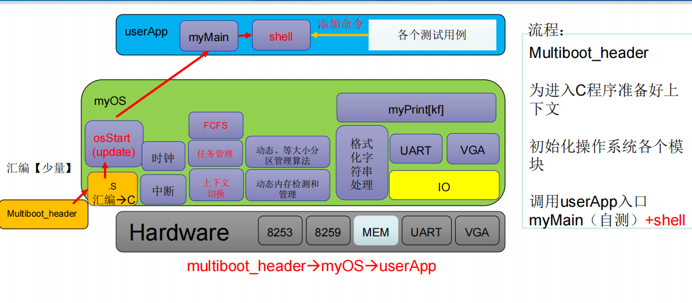
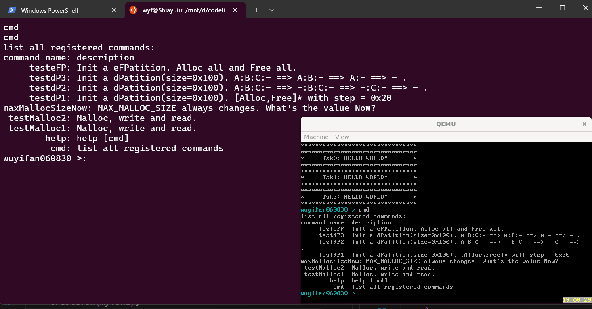

# 实验5 任务管理和FCFS

## 原理说明

* 软件结构框图及主流程的流程图
  

上面的图片来自于老师给出的实验PPT。可以看出，本次实验的主流程为：由Multiboot_header引导程序启动->osStart->初始化时钟并开中断->进入用户程序运行，实现各测试用tsk和Shell。

## 主要功能模块实现

我的实验5基于助教给出的框架代码做了一定修改完成。

下面给出task.c文件中各函数的实现：

```c
//初始化就绪队列（需要填写）
void rqFCFSInit(myTCB* idleTsk) {//对rqFCFS进行初始化处理
     rqFCFS.head = rqFCFS.tail = NULL;
     rqFCFS.idleTsk = idleTsk;
}

//如果就绪队列为空，返回True（需要填写）
int rqFCFSIsEmpty(void) {
     //当head和tail均为NULL时，rqFCFS为空
     if(rqFCFS.head == NULL && rqFCFS.tail == NULL) {
          return 1;
     }
     else return 0;
}

//获取就绪队列的头结点信息，并返回（需要填写）
myTCB * nextFCFSTsk(void) {//获取下一个Tsk
     if(rqFCFSIsEmpty()){
          return NULL;
     }
     else {
          return rqFCFS.head;
     }
}
//将一个未在就绪队列中的TCB加入到就绪队列中（需要填写）
void tskEnqueueFCFS(myTCB *tsk) {//将tsk入队rqFCFS   

     if(rqFCFSIsEmpty()){
          rqFCFS.head = rqFCFS.tail = tsk;//将头尾指针都指向tsk
          rqFCFS.tail->nextTCB = NULL;//尾指针的next域需指向NULL
     }
     else {
          rqFCFS.tail->nextTCB = tsk;
          rqFCFS.tail = tsk;
          rqFCFS.tail->nextTCB = NULL;//同上
     }
     tsk->TSK_State = TSK_RDY;//修改tsk状态
     return;
}

//将就绪队列中的TCB移除（需要填写）
void tskDequeueFCFS(myTCB *tsk) {//rqFCFS出队
     if(rqFCFSIsEmpty()){
          return;
     }
     myTCB* temp = rqFCFS.head;
   
     if(rqFCFS.head == rqFCFS.tail){//队列中只有一个元素的情况
          if(rqFCFS.head == tsk){
               rqFCFS.head->TSK_State = TSK_WAIT;
               rqFCFS.head = rqFCFS.tail = NULL;
          }
          else return;
     }
     else{
          if(rqFCFS.head == tsk){//有多个元素的情况，让头结点出队
               rqFCFS.head->TSK_State = TSK_WAIT;
               rqFCFS.head = temp->nextTCB;
   
          }
     }
}
```

```c
//以tskBody为参数在进程池中创建一个进程，并调用tskStart函数，将其加入就绪队列（需要填写）
int createTsk(void (*tskBody)(void)){//在进程池中创建一个进程，并把该进程加入到rqFCFS队列中
     if(!firstFreeTsk) {
          return -1;
     }
     for(int i=1;i<TASK_NUM;i++){//更新firstFreeTsk
          if(tcbPool[i].TSK_State==TSK_NONE){
               firstFreeTsk = &tcbPool[i];
               break;
          }
     } 
     myTCB *newTsk = firstFreeTsk;
     newTsk->task_entrance = tskBody;
     newTsk->stkTop = newTsk->stack + STACK_SIZE - 1;
     stack_init(&newTsk->stkTop, tskBody);

     tskStart(newTsk);
     return newTsk->TSK_ID;
}

//以takIndex为关键字，在进程池中寻找并销毁takIndex对应的进程（需要填写）
void destroyTsk(int takIndex) {//在进程中寻找TSK_ID为takIndex的进程，并销毁该进程
     tcbPool[takIndex].TSK_State = TSK_NONE;
     tcbPool[takIndex].task_entrance = tskEmpty;
     tcbPool[takIndex].stkTop = tcbPool[takIndex].stack + STACK_SIZE - 1;
     firstFreeTsk = &tcbPool[takIndex];
}
```

上面给出了本次实验Task.c文件中实现的各个模块和必要的注释。

## 思考题

**1.** 注意到我们维护了两个全局变量 `prevTSK_StackPtr` 及 `nextTSK_StackPtr`，这两个全局变量分别会在进行上下文切换时被赋值为“前一个任务栈顶指针的地址”和“后一个任务的栈顶指针值”。此时在调用CTX_SW时，eip的值自动被压入当前任务的栈中。经过pushf、pusha、popa、popf后栈顶内容就是之前保存的eip的内容，直接ret即可，因而不需要先call后ret。

**2.** stack_init函数实际上是初始化了一个任务的上下文寄存器。这是因为CTX_SW所执行的上下文切换的过程需要基于后一个任务上下文的寄存器已经保存在栈中，如果不进行初始化的话，会导致栈溢出。在这里，八个通用寄存器的入栈内容是自由的。

**3.** 在myTCB结构体中定义的stack[STACK_SIZE]实际上确定了栈内存空间的最底部，起到保护作用（防止栈溢出）；BspContextBase[STACK_SIZE]的作用类似，在多任务调度模式下确定栈内存空间的最低地址，防止溢出导致错误。

**4.** `prevTSK_StackPtr`是二级指针，其指向的是前一个任务的栈顶指针，即是一个指向指针的指针。

## 运行结果及说明

在wsl的Ubuntu环境下运行，得到的结果如下：



经比对可知，运行结果是正确的。
